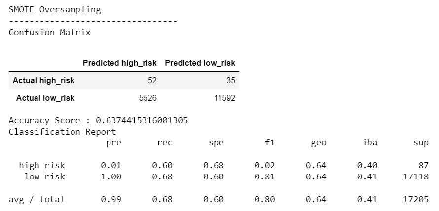
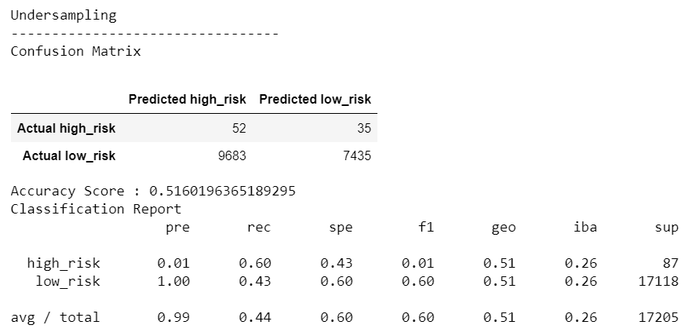
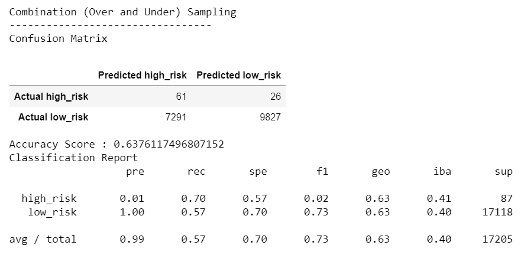
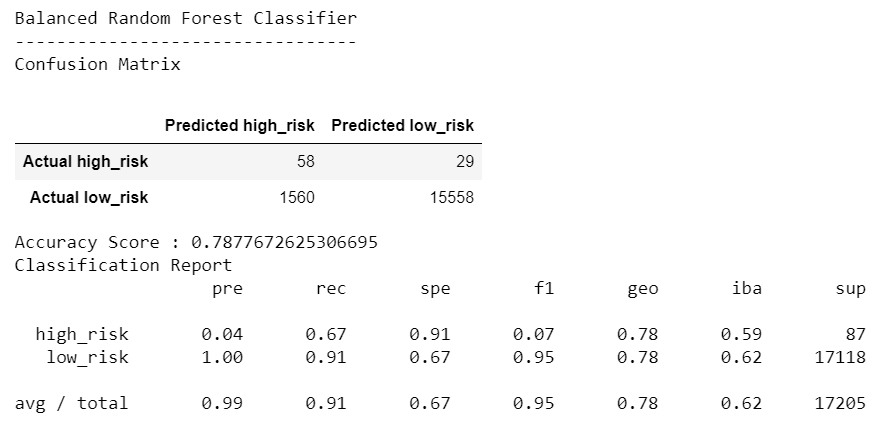
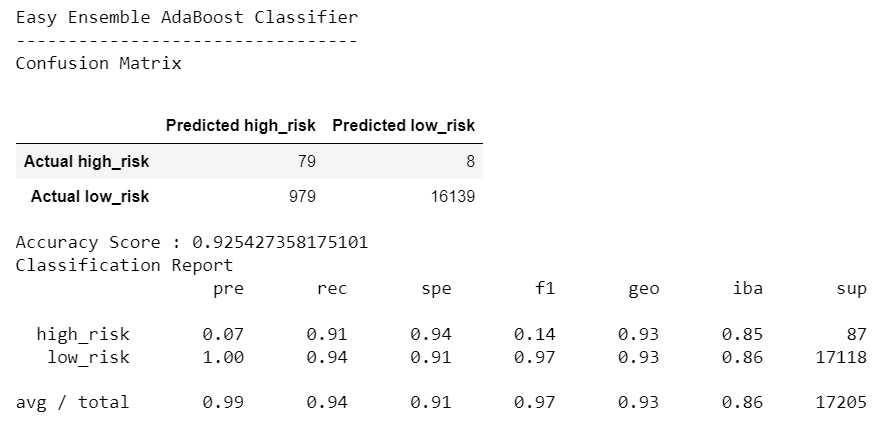

# Credit_Risk_Analysis

## Overview
We will be using resampling to build and evaluate different models predicting credit risk, because there is a large imbalance between good laons and risky loans. Using a credit card dataset we'll oversample with RandomOverSampler and SMOTE, undersample with ClusterCentroids, over-and-undersample with SMOTEENN, and also use BalnacedRandomForestClassifier and EasyEnsembleClassifier to reduce bias. Then we'll be able to assess the accuracy, percision, and recall of each model.

## Results
### Random Oversampler Algorithm

 - The Balanced Accuracy Score is 64%
 - Precision
 - Recall

### Oversampling SMOTE Algorithm

- The Balanced Accuracy Score is 
- Precision
- Recall

### Undersampling Cluster Centroids Algorithm

- Balanced Accuracy Score
- Precision
- Recall

### Combination Sampling SMOTEENN Algorithm

- Balanced Accuracy Score
- Precision
- Recall

### Balanced Random Forest Classifier Algorithm

- Balanced Accuracy Score
- Precision
- Recall

### Easy Ensemble Classifier Algorithm

- Balanced Accuracy Score
- Precision
- Recall

## Summary
Recommendation:

Summarize why recommendation

