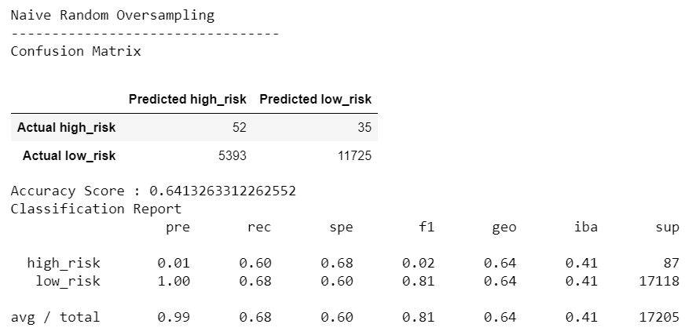

# Credit_Risk_Analysis

## Overview
Text

## Results
### Random Oversampler Algorithm

 - Balanced Accuracy Score
 - Precision
 - Recall

### Oversampling SMOTE Algorithm

- Balanced Accuracy Score
- Precision
- Recall

### Undersampling Cluster Centroids Algorithm

- Balanced Accuracy Score
- Precision
- Recall

### Combination Sampling SMOTEENN Algorithm

- Balanced Accuracy Score
- Precision
- Recall

### Balanced Random Forest Classifier Algorithm

- Balanced Accuracy Score
- Precision
- Recall

### Easy Ensemble Classifier Algorithm

- Balanced Accuracy Score
- Precision
- Recall

## Summary
Recommendation:

Summarize why recommendation

